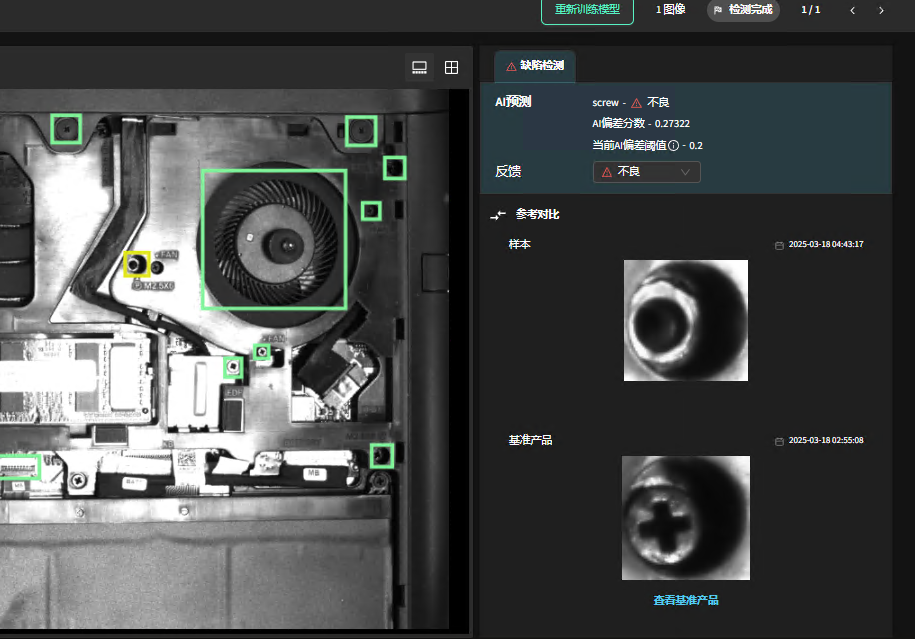
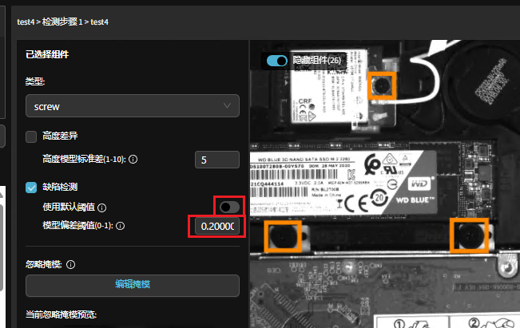

检测模型的 AI 偏差分数和阈值
==========================

在检测过程中，您可以点击一个部件，查看模型检测出的 AI 偏差分数以及当前设定的偏差阈值。

**AI 偏差分数** 代表了深度学习模型判断当前样本与正常样本之间相似度的指标。  

- 当该值越接近 0 时，说明样本与正常样本越接近；  
- 当该值越接近 1 时，说明样本与正常样本差异较大。

**阈值** 的作用是设定正常与异常之间的分界点：  

- 任何 AI 偏差值低于该阈值的部件，将被判定为正常；  
- AI 偏差值高于该阈值的部件，则被判定为异常。

系统初始默认使用 **0.5** 作为偏差阈值；  
随着数据集的不断增加 —— 当正常样本数量大于 10 或异常样本数量大于 1 时，系统会自动重新计算偏差值并更新默认阈值。

在“定义产品”页面中，您可以选择：
  
1. 继续使用系统默认值，或  
2. 取消启用系统默认值，并根据经验手动设定您认为最合适的阈值。

操作步骤：
  
1. 首先取消启用“系统默认值”；  
2. 然后输入您想要设定的偏差阈值。

