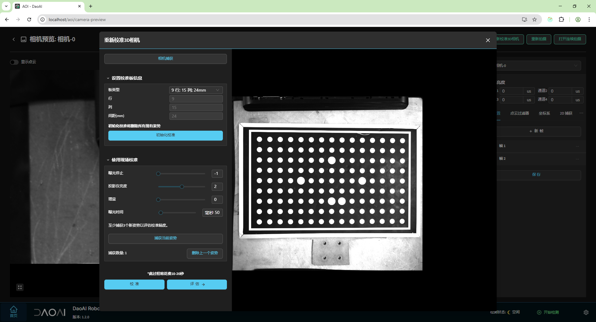

相机精度验证和校准
====================

2D 相机
--------------

2D 相机主要通过调焦来确保图像的清晰度。当图像清晰度调整完成后，可以使用 2D 相机校准工具进行校准。

首先，点击 **相机捕获**，调整亮度至合适的状态。选择校准板尺寸，接着，点击 **评估** 按钮，查看真实度误差情况。如果误差较高，建议进行 2D 校准。

2D 校准的目的是根据校准板的已知尺寸，纠正相机拍摄图像中的畸变和变形现象。

完成校准后，校准板覆盖的区域可以视为准确，而未覆盖的区域可能会出现一些边缘的畸变，这属于正常现象。
为了获得最佳的 2D 校准效果，建议尽可能使校准板覆盖大部分甚至整个画面。

校准步骤：
    - 选择校准板的尺寸。
    - 点击“初始化校准”。
    - 捕获当前姿势（2D 校准只需一张图片）。
    - 点击“校准” 完成操作。

如果需要取消校准，可以通过删除 AOI 安装目录中的 .perspective 文件，将 2D 相机恢复到初始状态。

.. image:: ./images/calibrate_2d_2.png
    :scale: 50%

3D 相机
----------

3D 相机通常具有预设的对焦距离，首先需要确保相机的安装高度符合对焦距离的要求。

可以通过点击 **重新校准 3D 相机** 按钮来评估精度。

首先，点击 **相机捕获**，并调整亮度至合适的状态。

选择校准板尺寸，然后点击 **初始化校准**。

点击 **评估**，相机的精度分析结果将显示出来。如果真实度误差过高，建议进行重新校准。

校准步骤：
    - 调整亮度参数，避免校准板过曝。
    - 选择校准板的尺寸。
    - 点击 **初始化校准**。
    - **捕获当前姿势**。
    - 移动、旋转或倾斜校准板，重复捕获 3-5 个不同的姿势。
    - 点击 **校准** 完成操作。

