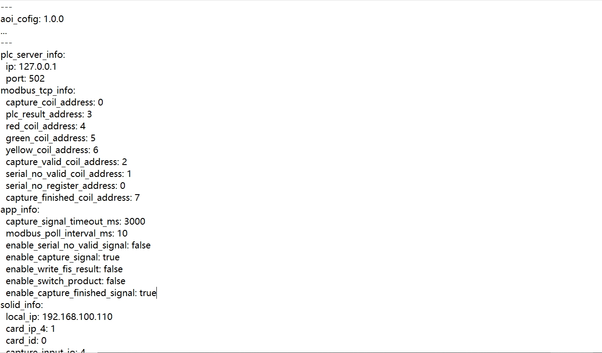

AOI && Modbus 通信使用
============================

本篇文档介绍如何配置 AOI 系统与 Modbus 通信，并说明相关配置文件参数以及通信调试操作。

配置文件步骤
---------------------

1. **获取配置文件**  
   从下载中心下载以下两个文件：  
   - ``aoi_comm_config``  
   - ``MbslaveAOI``  
   
   下载地址：  
   `下载中心 <https://daoairoboticsinc-my.sharepoint.com/:f:/g/personal/nrd_daoai_com/Eq9YkJXO2UVJqDX2XRGL1xQBN_y_mjyaIYrKFndIEfFZ-w?e=Iyp0zt>`_

2. **放置配置文件**  
   将下载得到的 ``aoi_comm_config`` 文件放置到 AOI 系统的根目录下。  

   .. image:: ./images/130.png
      :scale: 80%
      :alt: 放置aoi_comm_config文件于AOI根目录

aoi_comm_config 文件参数详解
-----------------------------------------

下面是配置文件中各参数的说明：

- **plc_server_info**: 表示 PLC 的地址和端口号  
- **capture_coil_address**: 0  
  拍照检测（光电感应）信号地址，由 PLC 发送给 AOI  
- **plc_result_address**: 3  
  拍照检测结果地址，由 AOI 发送给 PLC  
- **red_coil_address**: 4  
  检测三色灯红色信号地址，由 AOI 发送给 PLC  
- **green_coil_address**: 5  
  检测三色灯绿色信号地址，由 AOI 发送给 PLC  
- **yellow_coil_address**: 6  
  检测三色灯黄色信号地址，由 AOI 发送给 PLC  
- **capture_valid_coil_address**: 2  
  拍照检测信号是否有效地址，由 PLC 发送给 AOI  
- **serial_no_valid_coil_address**: 1  
  扫码内容是否有效的信号地址，由 PLC 发送给 AOI  
- **serial_no_register_address**: 0  
  扫码枪数据寄存器地址，由 PLC 发送给 AOI  
- **capture_finished_coil_address**: 7  
  拍照检测完成信号地址，由 AOI 发送给 PLC  
- **capture_signal_timeout_ms**: 3000  
  等待检测信号的超时时间（毫秒）  
- **modbus_poll_interval_ms**: 10  
  Modbus 轮询间隔时间（毫秒）  
- **enable_serial_no_valid_signal**: false  
  是否启用扫码枪有效性信号（false 关闭，true 打开）  
- **enable_capture_signal**: true  
  是否采集 PLC 拍照检测信号（true 打开）  
- **enable_switch_product**: false  
  是否支持切换产品（false 关闭）  
- **enable_capture_finished_signal**: true  
  是否发送采集完成信号  

AOI 的 Modbus 通讯操作
-------------------------------

1. **连接 MbslaveAOI**  
   启动 ``MbslaveAOI`` 软件，点击“连接”按钮建立通信。  

   .. image:: ./images/132.png
      :scale: 50%
      :alt: MbslaveAOI连接界面

2. **选择产品检测任务**  
   打开 AOI 软件，在检测任务中选择你需要检测的产品。  

   .. image:: ./images/133.png
      :scale: 50%
      :alt: AOI检测任务界面

3. **触发检测信号**  
   在 ``MbslaveAOI`` 软件中，双击线圈 2 的地址内容，将其设置为 ON，然后点击“OK”。  

   .. image:: ./images/134.png
      :scale: 50%
      :alt: 设置线圈地址为 ON

4. **检测结果反馈**  
   - 当产品检测为 NG 时，``MbslaveAOI`` 中的检测结果显示为 0，同时三色灯信号中红色亮起（值为 1）：  

     .. image:: ./images/136.png
        :scale: 50%
        :alt: 检测结果为 NG 时红色灯亮

     .. image:: ./images/135.png
        :scale: 50%
        :alt: NG 检测反馈示例

   - 当产品检测为 OK 时，``MbslaveAOI`` 中的检测结果显示为 1，同时三色灯信号中绿色亮起（值为 1）：  

     .. image:: ./images/137.png
        :scale: 50%
        :alt: 检测结果为 OK 时绿色灯亮

     .. image:: ./images/138.png
        :scale: 50%
        :alt: OK 检测反馈示例
