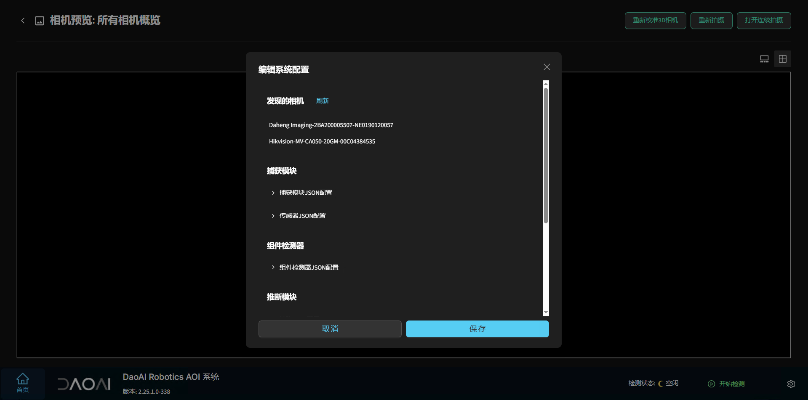

连接多个相机
=================

更改配置文件
------------

在需要连接多个相机时，首先在 **AOI** 软件中，点击“编辑系统配置”，然后选择“发现相机”，确保可以找到两个或多个相机：

记下相机的名称后，在 **AOI** 安装目录下（如 `C:\Program Files\DaoAI AOI\capture_agent\sensor_config.json`）中，添加对应的相机对象，并将其 `camera_name` 改为你在软件中看到的相机名称：

对于第二个（或更多）相机对象，需要更改 `id` 和 `capture_step` 为递增的数值：第二个相机改为 `1`，第三个相机改为 `2`，以此类推。

.. note::
   如果是 2D 相机，需要将 `is_3D` 设置为 `false`。

接着，在安装目录下的 `system_config.json` 文件中，将 `camera_view_layout`、`inspection_view_layout` 和 `inference_steps` 后面的数值改为相机的数量。如果有两个相机就改为 `2`，三个相机就改为 `3`，以此类推。

然后，打开安装目录下的 `capture_agent/capture_agent_config.json`，在 `steps` 列表中加入对应数量的相机配置对象。如下图所示，当使用两个相机时，添加第二个步骤（第三个相机则添加第三个步骤，依此类推）：

完成以上操作后，重启 **AOI** 系统。

使用多个相机
-------------

重启后，可以在界面上看到两个拍照窗口，分别对应两个相机的画面：

点击对应的相机窗口，即可选中该相机和实时画面。此时，界面会放大展示所选相机的拍摄图像，并展开该相机的配置面板。若需返回多相机视图，可点击右上角的多窗口显示图标：

定义产品时，先选择一个相机窗口，按照常规流程定义产品。完成后，返回多窗口视图，然后重复以上步骤为第二个相机定义产品。若有更多相机，同理进行定义：

随后，正常训练模型并开始检测即可：

