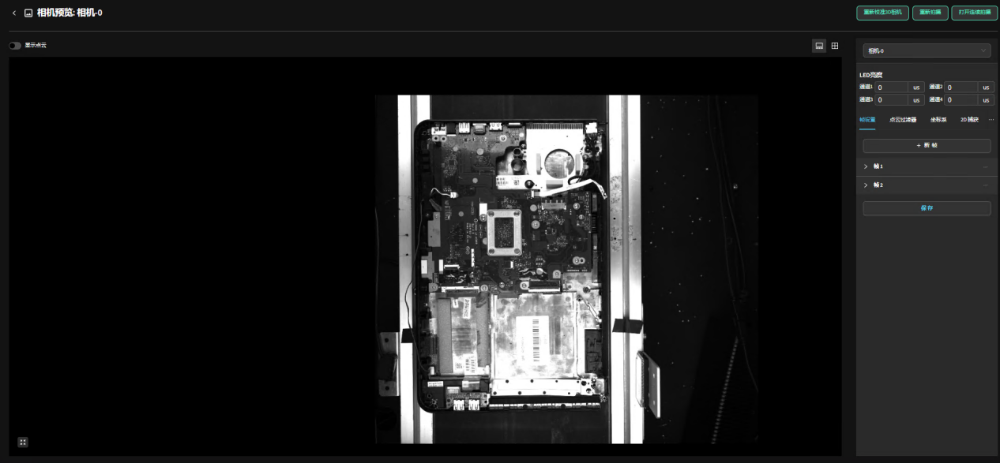
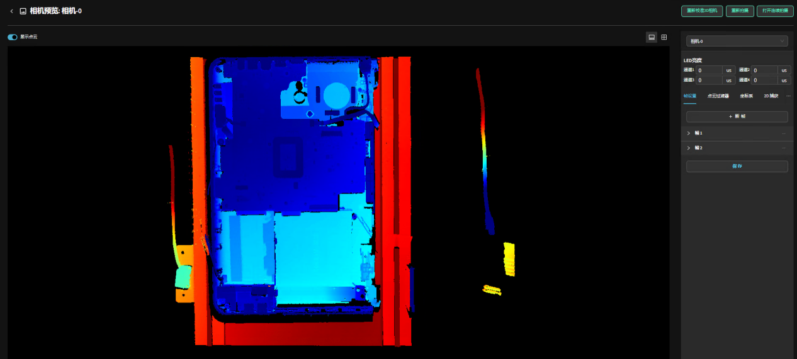
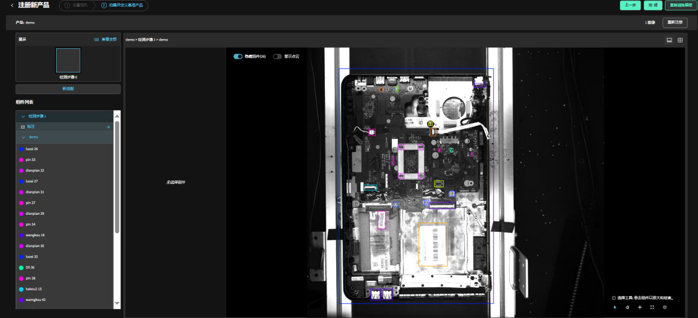

实际案例：笔记本零部件检测
===============================

本案例展示如何检测笔记本内指定零件的安装情况和高度差，以提高产品质量合格率。
    
.. raw:: html
  
  

      <video width="80%" height="auto" controls>
          <source src="http://docs.welinkirt.com/static/videos/aoi_case_1.mp4" type="video/mp4">
      </video>
  

|

优势
----

- **高精度检测能力**  
  视觉大模型通过深度学习技术，能够准确检测笔记本内部零件是否存在以及是否安装到位，有效减少人为误差。

- **自动化与高效率**  
  利用视觉大模型实现自动化检测流程，大幅提高检测效率。特别是在大规模生产中，在更换未知产品时可快速建模，显著降低产线时间和人力成本。

- **强大的特征提取能力**  
  模型能够精准检测零部件的微小缺陷，区别于传统的模板比对方法。

- **少量样本训练**  
  DaoAI AOI 系统仅需 1 至 20 张常规样本，即可完成非监督缺陷检测训练，前期工作量和成本大幅降低。

难点
----

笔记本零部件种类繁多且尺寸细小，加之产品材质多为反光材料，容易在点云拍摄中丢失细节，同时不同材质对高度信息的检测要求各异。

解决方案
---------

采用微链 AOI 相机，并利用多角度混合光源进行检测，确保获得完整的点云数据，并根据实际产品情况调整右侧参数以适配当前效果。

调整笔记本 3D 效果：

点击左上角显示点云：

定义好检测的模型：

遇到 NG 判定 OK 操作
------------------------

- **情况一：全部产品为 OK**  
  若检测结果显示所有产品均为 OK，则点击左侧“全部”按钮，将其统一标记为 OK。

  .. image:: ./image/63.png
     :scale: 80%
     :alt: 全部标记为 OK

- **情况二：当前组件为 NG，但标记为 OK**  
  若检测中发现组件异常，但默认标记为 OK，则点击该组件，选择“不良”，并手动圈出不良部位后提交反馈。

  .. image:: ./image/64.png
     :scale: 80%
     :alt: 选择不良并标记异常区域

模型训练与验证
-----------------

经过一版模型在大约 10 张数据上的测试后，点击“重新训练模型”，更新后即可得到更优的检测效果。

**结果验证**

- **OK 状态：**

  .. image:: ./image/65.png
     :scale: 80%
     :alt: OK 产品检测结果

- **NG 状态（组件异常）：**

  .. image:: ./image/66.png
     :scale: 80%
     :alt: 组件异常检测结果

  .. image:: ./image/67.png
     :scale: 80%
     :alt: 组件异常检测结果（细节展示）

- **NG 状态（高度异常）：**

  .. image:: ./image/68.png
     :scale: 80%
     :alt: 高度异常检测结果
