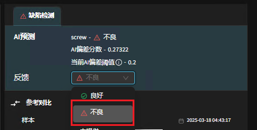

**实际案例：笔记本零部件检测**
===============================

检测笔记本中的指定零件，并检测高度差，提高产品质量保障合格率
**优势**

**高精度检测能力**：视觉大模型通过深度学习技术，能够实现对笔记本内部零件是否存在以及是否安装到位的高精度检测，减少人为因素导致的误差。

**自动化和效率**：利用视觉大模型可以自动化检测流程，大幅提高检测效率，尤其是在大规模生产环境中，在更换未知的产品时可做到快速建模，减少产线上的时间和人力成本

**强大的特征提取能力**：对于零部件的微小缺陷也可以做到精准检测，区别于传统的模板比对

**少量样本训练**：DaoAI AOI系统仅需1-20张常规样本，就可以完成非监督缺陷检测训练，显著降低了前期的工作量和成本

**难点**：笔记本上的零件检测品类繁多且细小，产品材质多有反光，对于点云拍摄容易丢失，零件材质不同，且要检测高度信息

**解决方案**：使用微链AOI相机，使用多角度混合光源

调整笔记本的3D效果，调整右侧参数适配当前产品效果

    .. image:: ./image/60.png
      :scale: 80%

点击左上角显示点云

    .. image:: ./image/61.png
      :scale: 80%

定义好检测的模型

    .. image:: ./image/62.png
      :scale: 80%

**遇到NG判定OK操作**

情况一：如全部是OK产品，那么点击左侧全部标记为OK

    .. image:: ./image/63.png
      :scale: 80%

情况二：如遇到当前组件为NG，但是标明为OK的情况下，则点击组件，选择不良，画出不良部位提交

如此用一版模型测试10张左右的数据后从新训练模型即可

**下面结果验证**

**OK**

    .. image:: ./image/65.png
      :scale: 80%

**NG**(组件异常)

    .. image:: ./image/66.png
      :scale: 80%

    .. image:: ./image/67.png
      :scale: 80%

**NG**（高度异常）

    .. image:: ./image/68.png
      :scale: 80%

